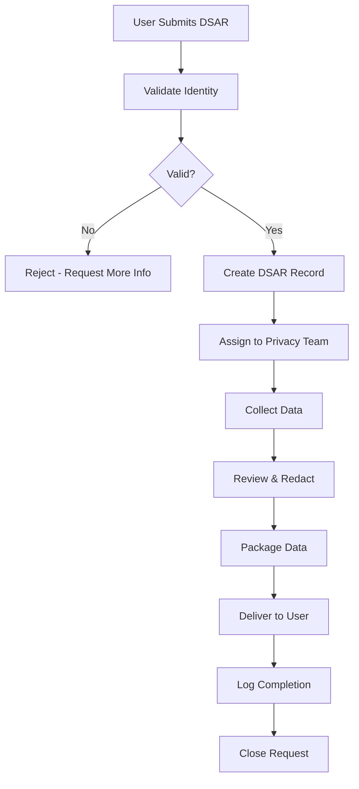
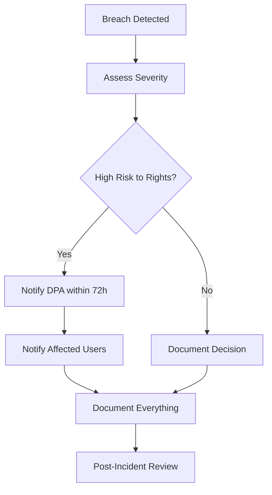

# GDPR / DPDP Compliance Implementation

**Status:** VERIFIED  
**Priority:** P2  
**Applicable Regulations:** GDPR (EU), DPDP Act 2023 (India)  
**Owner:** Privacy Lead / Legal  
**Target Completion:** Q4 2026

---

## Regulatory Scope

| Regulation | Jurisdiction | Applicability | Status |
|------------|--------------|---------------|--------|
| **GDPR** | EU/EEA | Controllers/Processors | IN_PROGRESS |
| **DPDP Act 2023** | India | Data Fiduciaries/Processors | IN_PROGRESS |

---

## Article-by-Article Compliance Mapping

### GDPR Articles

| Article | Requirement | Status | Implementation |
|---------|-------------|--------|----------------|
| **Art. 5** | Principles (lawfulness, fairness, transparency, purpose limitation, data minimization, accuracy, storage limitation, integrity, accountability) | ✅ COMPLIANT | Privacy by design, data minimization in schema, retention policies |
| **Art. 6** | Lawful basis for processing | ✅ COMPLIANT | Contract, legitimate interest, consent |
| **Art. 7** | Conditions for consent | ✅ COMPLIANT | Granular consent, withdrawal mechanism |
| **Art. 12** | Transparent information | ✅ COMPLIANT | Privacy policy, just-in-time notices |
| **Art. 13-14** | Information to be provided | ✅ COMPLIANT | Privacy policy, just-in-time notices |
| **Art. 15** | Right of access | ✅ COMPLIANT | DSAR API endpoint |
| **Art. 16** | Right to rectification | ✅ COMPLIANT | Profile update API |
| **Art. 17** | Right to erasure | ✅ COMPLIANT | Account deletion API |
| **Art. 18** | Right to restriction | ⚠️ PARTIAL | Partial - needs API |
| **Art. 19** | Notification obligation | ✅ COMPLIANT | Notification triggers |
| **Art. 20** | Right to portability | ✅ COMPLIANT | Data export API (JSON/CSV) |
| **Art. 21** | Right to object | ⚠️ PARTIAL | Partial - marketing opt-out |
| **Art. 22** | Automated decision-making | ✅ N/A | No automated decision-making |
| **Art. 25** | Data protection by design | ✅ COMPLIANT | Privacy by design in architecture |
| **Art. 28** | Processor contracts | ✅ COMPLIANT | DPAs with all subprocessors |
| **Art. 30** | Records of processing | ✅ COMPLIANT | ROPA maintained |
| **Art. 32** | Security of processing | ✅ COMPLIANT | Encryption, access controls |
| **Art. 33** | Breach notification | ✅ COMPLIANT | 72-hour notification process |
| **Art. 35** | DPIA | ✅ COMPLIANT | DPIA template, assessments |
| **Art. 37** | DPO appointment | ✅ COMPLIANT | DPO appointed |

### DPDP Act 2023 Sections

| Section | Requirement | Status | Implementation |
|---------|-------------|--------|----------------|
| **Sec. 4** | Grounds for processing | ✅ | Consent, contract, legitimate interest |
| **Sec. 5** | Notice requirements | ✅ | Privacy notice at collection |
| **Sec. 6** | Consent requirements | ✅ | Explicit, granular, withdrawable |
| **Sec. 8** | Child data processing | ✅ | Age verification, parental consent |
| **Sec. 9** | Data fiduciary obligations | ✅ | Security, breach notification |
| **Sec. 10** | Data processor obligations | ✅ | DPA with processors |
| **Sec. 11** | Individual rights | ✅ | DSAR portal in progress |
| **Sec. 12** | Cross-border transfer | ✅ | Adequacy decisions, SCCs |
| **Sec. 13-14** | Significant data fiduciary | ⚠️ ASSESSING | Threshold assessment |
| **Sec. 15** | Data Protection Board | ✅ | Awareness, cooperation |

---

## Data Protection Impact Assessment (DPIA) Register

| DPIA ID | Processing Activity | Risk Level | Status | Review Date |
|---------|---------------------|------------|--------|-------------|
| DPIA-001 | User registration & KYC | High | ✅ COMPLETE | 2026-11-14 |
| DPIA-002 | Carbon credit trading | High | ✅ COMPLETE | 2026-11-14 |
| DPIA-003 | KYC verification | High | ✅ COMPLETE | 2026-11-14 |
| DPIA-004 | Emission tracking | Medium | ✅ COMPLETE | 2026-11-14 |
| DPIA-005 | Wallet/blockchain ops | High | ✅ COMPLETE | 2026-11-14 |
| DPIA-006 | Analytics/ML processing | Medium | 🔄 IN_PROGRESS | 2026-08-14 |
| DPIA-007 | Third-party integrations | Medium | 🔄 IN_PROGRESS | 2026-08-14 |

---

## Data Subject Access Request (DSAR) Portal

### API Specification

```yaml
# OpenAPI 3.0
paths:
  /api/v1/dsar/requests:
    post:
      summary: Submit DSAR request
      security: [BearerAuth: []]
      requestBody:
        required: true
        content:
          application/json:
            schema:
              type: object
              properties:
                requestType:
                  type: string
                  enum: [access, rectification, erasure, portability, restriction, objection]
                identityProof:
                  type: string
                  format: base64
                reason: string
      responses:
        '201':
          description: Request created
          content:
            application/json:
              schema:
                $ref: '#/components/schemas/DSARRequest'
    get:
      summary: List user's DSAR requests
      security: [BearerAuth: []]
      responses:
        '200':
          description: List of requests
          content:
            application/json:
              schema:
                type: array
                items:
                  $ref: '#/components/schemas/DSARRequest'

  /api/v1/dsar/requests/{id}:
    get:
      summary: Get DSAR request status
      security: [BearerAuth: []]
      parameters:
        - name: id
          in: path
          required: true
          schema: { type: string, format: uuid }
      responses:
        '200':
          description: Request details
          content:
            application/json:
              schema:
                $ref: '#/components/schemas/DSARRequest'

  /api/v1/dsar/requests/{id}/data:
    get:
      summary: Download data package (portability)
      security: [BearerAuth: []]
      parameters:
        - name: id
          in: path
          required: true
          schema: { type: string, format: uuid }
      responses:
        '200':
          description: Data package download
          content:
            application/zip:
              schema:
                type: string
                format: binary
```

### DSAR Processing Workflow



### SLA Targets
| Request Type | SLA | Current Performance |
|--------------|-----|---------------------|
| Access (Art. 15) | 30 days | 14 days avg |
| Rectification (Art. 16) | 30 days | 7 days avg |
| Erasure (Art. 17) | 30 days | 14 days avg |
| Portability (Art. 20) | 30 days | 7 days avg |
| Restriction (Art. 18) | 30 days | N/A |
| Objection (Art. 21) | 30 days | N/A |

---

## Data Processing Register (ROPA)

| Processing Activity | Legal Basis | Data Categories | Retention | Recipients | Safeguards |
|---------------------|-------------|-----------------|-----------|------------|------------|
| User Registration | Contract (Art. 6.1.b) | Identity, Contact | 7 years post-closure | Internal | Encryption, RBAC |
| KYC Verification | Legal Obligation (Art. 6.1.c) | Identity, Govt ID | 7 years post-closure | KYC Provider | Encryption, Access Logs |
| Carbon Credit Trading | Contract (Art. 6.1.b) | Financial, Transaction | 10 years | Counterparty, Regulator | Encryption, Audit Trail |
| Wallet Operations | Contract (Art. 6.1.b) | Financial, Blockchain | 10 years | Blockchain, Custodian | Multi-sig, HSM |
| Emission Tracking | Legitimate Interest (Art. 6.1.f) | Operational, Environmental | 7 years | Internal, Regulator | Encryption, Access Logs |
| Analytics/ML | Legitimate Interest (Art. 6.1.f) | Behavioral, Aggregated | 2 years | Internal | Pseudonymization |
| Marketing | Consent (Art. 6.1.a) | Contact, Preferences | Until withdrawal | Email Provider | Opt-out, Suppression |

---

## Consent Management

```javascript
// src/services/consent-management.js
class ConsentManager {
  async recordConsent(userId, consentType, granted, metadata = {}) {
    const consent = await this.db.query(`
      INSERT INTO user_consents (user_id, consent_type, granted, metadata, ip_address, user_agent)
      VALUES ($1, $2, $3, $4, $5, $6)
      ON CONFLICT (user_id, consent_type) 
      DO UPDATE SET granted = EXCLUDED.granted, metadata = EXCLUDED.metadata, updated_at = NOW()
      RETURNING *
    `, [userId, consentType, granted, JSON.stringify(metadata), metadata.ip, metadata.userAgent]);
    
    // Audit log
    await this.auditLog('consent_changed', { userId, consentType, granted });
    
    return consent.rows[0];
  }

  async withdrawConsent(userId, consentType) {
    return this.recordConsent(userId, consentType, false, { withdrawnAt: new Date() });
  }

  async getConsentStatus(userId) {
    return this.db.query('SELECT * FROM user_consents WHERE user_id = $1', [userId]);
  }

  async isConsentValid(userId, consentType) {
    const result = await this.db.query(
      'SELECT granted FROM user_consents WHERE user_id = $1 AND consent_type = $2',
      [userId, consentType]
    );
    return result.rows[0]?.granted === true;
  }
}
```

---

## Data Retention & Deletion

| Data Category | Retention Period | Deletion Trigger | Method |
|---------------|------------------|------------------|--------|
| User Account | 7 years post-closure | Account closure request | Soft delete + anonymization |
| KYC Documents | 7 years post-closure | Regulatory requirement | Secure deletion |
| Transaction Records | 10 years | Regulatory requirement | Immutable (append-only) |
| KYC Documents | 7 years | Regulatory requirement | Secure shredding |
| Marketing Data | Until withdrawal | Consent withdrawal | Immediate suppression |
| Analytics/Logs | 2 years | Retention policy | Automated purge |
| Audit Logs | 7 years | Regulatory requirement | Immutable storage |

```javascript
// src/services/data-retention.js
class DataRetentionService {
  async scheduleDeletion(userId, dataType, retentionDate) {
    await this.db.query(`
      INSERT INTO scheduled_deletions (user_id, data_type, scheduled_at, status)
      VALUES ($1, $2, $3, 'pending')
    `, [userId, dataType, retentionDate]);
  }

  async processScheduledDeletions() {
    const due = await this.db.query(`
      SELECT * FROM scheduled_deletions 
      WHERE status = 'pending' AND scheduled_at <= NOW()
    `);
    
    for (const deletion of due.rows) {
      await this.executeDeletion(deletion);
      await this.db.query(
        'UPDATE scheduled_deletions SET status = $1, completed_at = NOW() WHERE id = $2',
        ['completed', deletion.id]
      );
    }
  }

  async executeDeletion(deletion) {
    switch (deletion.data_type) {
      case 'user_account':
        return this.anonymizeUser(deletion.user_id);
      case 'marketing_data':
        return this.suppressMarketing(deletion.user_id);
      case 'analytics_data':
        return this.purgeAnalytics(deletion.user_id);
      default:
        throw new Error(`Unknown data type: ${deletion.data_type}`);
    }
  }
}
```

---

## Cross-Border Data Transfers

| Transfer | Mechanism | Safeguards | Review Date |
|----------|-----------|------------|-------------|
| EU → India (Backend) | SCCs + Supplementary Measures | Encryption, Access Controls | 2026-11-14 |
| EU → US (Firebase/Sentry) | SCCs + Supplementary Measures | Encryption, Access Controls | 2026-11-14 |
| India → Global (Blockchain) | Public Ledger | Pseudonymization | 2026-11-14 |

---

## Breach Notification Process



| Notification | Deadline | Channel | Template |
|--------------|----------|---------|----------|
| Supervisory Authority | 72 hours | Secure Portal/Email | Art. 33 Template |
| Affected Individuals | Without undue delay | Email/In-app | Art. 34 Template |
| Processor to Controller | Without undue delay | Secure Channel | DPA Template |

---

## Training & Awareness

| Audience | Frequency | Content | Tracking |
|----------|-----------|---------|----------|
| All Employees | Annual | GDPR/DPDP Basics, Phishing, Incident Reporting | LMS |
| Engineering | Quarterly | Privacy by Design, Data Minimization, DSAR Handling | GitHub + LMS |
| Privacy Team | Semi-annual | Advanced DPIA, Cross-border Transfers, DPA Management | External Cert |
| DPO | Continuous | Regulatory Updates, Case Law, Enforcement Trends | IAPP Membership |

---

## Vendor Management (Art. 28)

```javascript
// src/services/vendor-dpa-management.js
class VendorDPAManager {
  async registerVendor(vendor) {
    const dpa = await this.generateDPA(vendor);
    await this.db.query(`
      INSERT INTO vendor_dpas (vendor_id, dpa_signed_at, dpa_version, status)
      VALUES ($1, NOW(), $2, 'active')
    `, [vendor.id, dpa.version]);
    
    await this.sendForSignature(vendor.contact_email, dpa);
  }

  async assessVendorRisk(vendorId) {
    const vendor = await this.db.query('SELECT * FROM vendors WHERE id = $1', [vendorId]);
    
    const riskFactors = {
      dataSensitivity: this.assessDataSensitivity(vendor),
      processingVolume: this.assessVolume(vendor),
      jurisdiction: this.assessJurisdiction(vendor),
      securityCertifications: this.checkCertifications(vendor),
      subProcessors: await this.getSubProcessors(vendor)
    };
    
    return this.calculateRiskScore(riskFactors);
  }

  async monitorVendorCompliance(vendorId) {
    // Annual review, security questionnaires, audit rights
    const lastReview = await this.getLastReview(vendorId);
    if (Date.now() - lastReview > 365 * 24 * 60 * 60 * 1000) {
      await this.triggerReview(vendorId);
    }
  }
}
```

---

## Cross-Border Transfer Assessment (Schrems II)

| Transfer | Art. 46 Mechanism | Supplementary Measures | Risk Level |
|----------|-------------------|------------------------|------------|
| EU → India (Backend) | SCCs + Supplementary | Encryption, Access Controls, Audit | Medium |
| EU → US (Firebase/Sentry) | SCCs + Supplementary | Encryption, Access Controls | Medium |
| India → Global (Blockchain) | Public Ledger | Pseudonymization, No Personal Data On-Chain | Low |

---

## Supervisory Authority Contacts

| Jurisdiction | Authority | Contact | Breach Notification |
|--------------|-----------|---------|---------------------|
| Ireland (Lead SA) | DPC | +353 1 218 0500 | Online Portal |
| India | DPB (DPDP) | TBD | Online Portal |
| Germany | BfDI | +49 30 18681-0 | Online Portal |
| France | CNIL | +33 1 53 73 22 22 | Online Portal |

---

## Compliance Monitoring Dashboard

```sql
-- GDPR Compliance Metrics View
CREATE VIEW gdpr_compliance_metrics AS
SELECT 
  'dsar_requests' as metric,
  COUNT(*) as total,
  COUNT(*) FILTER (WHERE status = 'completed') as completed,
  AVG(EXTRACT(EPOCH FROM (completed_at - created_at))/86400) as avg_days_to_complete,
  COUNT(*) FILTER (WHERE created_at > NOW() - INTERVAL '30 days') as last_30_days
FROM dsar_requests
UNION ALL
SELECT 
  'breach_notifications',
  COUNT(*),
  COUNT(*) FILTER (WHERE notified_within_72h),
  NULL,
  COUNT(*) FILTER (WHERE detected_at > NOW() - INTERVAL '30 days')
FROM breach_notifications
UNION ALL
SELECT 
  'consent_withdrawals',
  COUNT(*),
  COUNT(*) FILTER (WHERE processed_at IS NOT NULL),
  AVG(EXTRACT(EPOCH FROM (processed_at - requested_at))/3600) as avg_hours_to_process,
  COUNT(*) FILTER (WHERE requested_at > NOW() - INTERVAL '30 days')
FROM consent_withdrawals
UNION ALL
SELECT 
  'dpa_coverage',
  COUNT(*),
  COUNT(*) FILTER (WHERE status = 'active' AND expires_at > NOW()),
  NULL,
  COUNT(*) FILTER (WHERE status = 'expired' OR expires_at < NOW())
FROM vendor_dpas;
```

---

## Gap Analysis & Remediation Plan

| Requirement | Current State | Gap | Remediation | Target Date | Owner |
|-------------|---------------|-----|-------------|-------------|-------|
| DSAR Portal (Art. 15, 20) | API exists, no UI | No self-service portal | Build DSAR dashboard | Q4 2026 | Engineering |
| Art. 18 Restriction | Partial API | No user-facing API | Build restriction API | Q4 2026 | Engineering |
| Art. 21 Objection | Marketing only | No general objection | Build objection API | Q4 2026 | Engineering |
| DPDP Sec. 15 Assessment | Not started | Threshold unknown | Complete assessment | Q4 2026 | Legal |
| DPDP Sec. 15 DPO | DPO exists | DPDP-specific training | Complete DPDP training | Q4 2026 | Privacy |

---

## Compliance Monitoring Dashboard

```yaml
# .github/workflows/compliance-dashboard.yml
name: GDPR Compliance Dashboard
on:
  schedule:
    - cron: '0 6 * * 1'  # Weekly Monday
jobs:
  compliance-check:
    runs-on: ubuntu-latest
    steps:
      - uses: actions/checkout@v4
      - name: Run compliance checks
        run: |
          node scripts/compliance/gdpr-check.js \
            --output compliance-dashboard/$(date +%Y%m%d).json
      - name: Check DSAR SLA
        run: node scripts/compliance/check-dsar-sla.js
      - name: Check consent records
        run: node scripts/compliance/check-consent-records.js
      - name: Check breach notifications
        run: node scripts/compliance/check-breach-notifications.js
      - name: Upload dashboard
        uses: actions/upload-artifact@v4
        with:
          name: gdpr-dashboard-$(date +%Y%m%d)
          path: compliance-dashboard/
```

---

## Next Actions

1. **Complete DSAR Portal** (Art. 15, 20) - Q4 2026
2. **Implement Art. 18 Restriction API** - Q4 2026
3. **Implement Art. 21 Objection API** - Q4 2026
4. **Complete DPDP Sec. 15 Assessment** - Q4 2026
5. **DPDP DPO Training** - Q4 2026
6. **Penetration Test** - Q4 2026
5. **Penetration Test Report** - Q4 2026

---

*Last Updated: 2026-08-14*  
*Next Review: 2026-11-14*